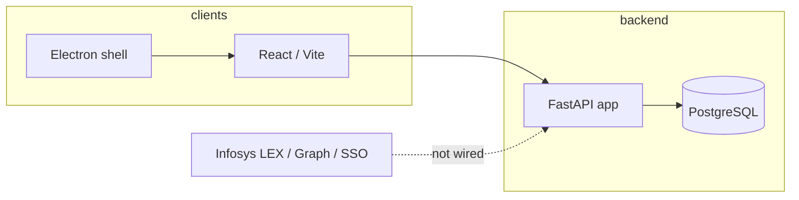

# Event Hub — technical reference & master plan alignment

This document **bridges** the long-form blueprint [`MASTER_IMPLEMENTATION_PLAN.md`](MASTER_IMPLEMENTATION_PLAN.md) (12 phases, workflows, testing, Zscaler, packaging) with **what the repository actually contains today**.

| Document | Role |
|----------|------|
| **This file** | Phase alignment, gaps vs master plan, architecture summary, where to look in code |
| [`planning/MASTER_FINAL_PLAN.md`](planning/MASTER_FINAL_PLAN.md) | PS-oriented closure plan (F0–F8), **Copilot integration index** → `backend/app/integrations/corporate_stubs.py` |
| [`planning/IMPLEMENTED_FEATURES.md`](planning/IMPLEMENTED_FEATURES.md) | Canonical **implemented** routes, models, UI routes, deferred items (§6) |
| [`CONTEXT.md`](CONTEXT.md) | Product intent, illustrative Infosys API table, mock vs real (some rows stale vs code) |
| [`planning/SYNTHESIS_AND_GAPS.md`](planning/SYNTHESIS_AND_GAPS.md) | Short crosswalk of plan vs codebase |
| [`planning/DESKTOP_APP_AND_INFOSYS_REMOTE_RUNBOOK.md`](planning/DESKTOP_APP_AND_INFOSYS_REMOTE_RUNBOOK.md) | Desktop “always on,” Infosys integration steps, remote deployment |

**Convention:** **Done** = matches the spirit of the phase for an MVP. **Partial** = subset shipped or different design choice. **Not done** = missing or stub only.

---

## 1. High-level architecture

- **API entry:** `backend/main.py` imports and exposes `app` (see `backend/app/main.py` factory).
- **Auth:** JWT access + refresh; dev login at `POST /auth/login`; **SSO** stub `POST /auth/login/sso` → **501**.
- **JSON:** snake_case over HTTP; frontend types in `frontend/src/types/api.ts`.

---

## 2. MASTER plan phases vs codebase (1–12)

### Phase 1 — Foundation (DB, structure, auth)

| Master expectation | Status | Notes |
|--------------------|--------|--------|
| PostgreSQL + SQLAlchemy async + Alembic | **Done** | Initial revision uses `metadata.create_all` bootstrap |
| JWT + `/auth/me` + `/health` | **Done** | Refresh token flow present |
| SSO proxy, `infosys_api.py`, Zscaler-aware `httpx` | **Not done** | No `infosys_api.py`; no `middleware/proxy_aware.py` |
| Phase 1 tests (auth unit/integration) | **Not done** | Only `backend/tests/test_health.py` smoke today |

### Phase 2 — Core event management

| Master expectation | Status | Notes |
|--------------------|--------|--------|
| Event CRUD, detail, submit, my-sessions, stats | **Done** | Routers + `event_service` |
| `.ics` per event + user aggregate | **Done** | Calendar endpoints |
| List filters: category, UI status, pagination | **Done** | See `GET /events` |
| List filters: **search**, **date range**, **group_id** (master catalog) | **Partial / gap** | Not exposed same as master endpoint table |
| Frontend: mock removal, hooks | **Largely done** | `mockEvents` may still exist for legacy UI pieces; dashboard/detail use API |
| Phase 2 tests | **Not done** | — |

### Phase 3 — Personas & governance

| Master expectation | Status | Notes |
|--------------------|--------|--------|
| Groups, group admins, approvals | **Done** | Group-scoped approval visibility for organizers |
| RBAC on routes | **Done** | `require_roles` / `get_current_user` patterns |
| Phase 3 tests | **Not done** | — |

### Phase 4 — Registration & calendar

| Master expectation | Status | Notes |
|--------------------|--------|--------|
| Register / cancel / waitlist / promote | **Done** | |
| Organizer attendee list + attend | **Done** | |
| Phase 4 tests | **Not done** | — |

### Phase 5 — Campaigns

| Master expectation | Status | Notes |
|--------------------|--------|--------|
| Campaign CRUD + scheduling concept | **Done** | |
| Real Teams/Viva/InfyMe post | **Not done** | Send-now **mock**; integrations routes mocked |
| Phase 5 tests | **Not done** | — |

### Phase 6 — Notifications

| Master expectation | Status | Notes |
|--------------------|--------|--------|
| In-app notifications API + several triggers | **Done** | Approvals, registration, waitlist, new-event (immediate prefs), reminders |
| **Daily / weekly digest** batch jobs | **Not done** | Frequency enum exists; batch delivery not implemented |
| Phase 6 tests | **Not done** | — |

### Phase 7 — Desktop (Electron)

| Master expectation | Status | Notes |
|--------------------|--------|--------|
| Tray + close-to-tray | **Partial / done** | See `electron/main.cjs` |
| Native OS notifications, badge, polling bridge | **Not done** | Web bell/polling only |
| Auto-start, `electron-updater`, health-driven backend restart | **Not done** | |
| Idle / “away 1h” pop | **Not done** | |
| Phase 7 manual test scripts | **Not formalized** | |

### Phase 8 — External integrations (Infosys / M365)

| Master expectation | Status | Notes |
|--------------------|--------|--------|
| LEX proxy for master data + caching | **Not done** | `/master-data/*` **static dev** |
| `/proxy/*` routes, session cookie forwarding | **Not done** | |
| Zscaler CA for `httpx` + Electron trust | **Not done** | Described in MASTER §7; not implemented as `ZSCALER_CA_PATH` client |
| MS Graph calendar (tier 2) | **Not done** | `.ics` tier 1 only |
| Real webhook / Graph for campaigns | **Not done** | |

### Phase 9 — Dashboard customization

| Master expectation | Status | Notes |
|--------------------|--------|--------|
| Preferences synced (types, frequency, groups, etc.) | **Largely done** | Including **followed groups** UI |
| Dashboard widget layout, persisted view modes, customizer panel | **Not done** | Dashboard uses category filter; no `DashboardCustomizer` as in master |
| Calendar page respects preference-driven default view | **Partial** | Verify against `Preference` fields |

### Phase 10 — Admin

| Master expectation | Status | Notes |
|--------------------|--------|--------|
| Users, roles, access matrix, stats | **Done** | |
| Audit log persisted + UI | **Done** | `audit_logs`; not full **middleware on every** state change as master text suggests |
| Config | **Partial** | **File** `backend/data/admin_config.json` vs master’s optional `AppConfig` DB model |
| Log **filters** (action, user, date range, pagination) | **Partial** | `GET /admin/logs` lists recent; query filters not as rich as master table |
| `POST /admin/groups/{id}/organizers` | **Gap** | Organizers tied via **`/groups/{id}/admins`** pattern instead (check OpenAPI) |

### Phase 11 — Recommendations / “AI”

| Master expectation | Status | Notes |
|--------------------|--------|--------|
| `/recommendations`, `/recommendations/trending` | **Done** | Heuristic scoring (not ML) |
| `/analytics/my-history` | **Not done** | Not in current catalog |
| Rich dashboard panels | **Partial** | Wire varies by page iteration |

### Phase 12 — Testing, security, production

| Master expectation | Status | Notes |
|--------------------|--------|--------|
| Broad pytest (auth, events, RBAC, workflows) | **Not done** | Smoke: `GET /health` only |
| Frontend Vitest + MSW breadth | **Partial** | `npm test` exists; coverage not at master targets |
| Playwright E2E suite | **Not done** | Dependency may exist; scenarios not as listed |
| `slowapi` / rate limits, strict CORS prod config | **Not done** | Dev-oriented CORS |
| Locust / Lighthouse CI | **Not done** | |
| CSP for Electron, secrets in vault | **Partial / ops** | Env-based secrets; no vault integration in repo |

---

## 3. Consolidated “remaining work” themes

Use this as a **backlog lens** (not a committed roadmap). Detail lives in MASTER sections **6–8** and §6 of `IMPLEMENTED_FEATURES.md`.

1. **Enterprise auth & Infosys**  
   Implement SSO exchange, `infosys_api` (or approved gateway client), Zscaler-aware TLS, replace static master-data and mocks with live proxies.

2. **Microsoft 365 / campaigns**  
   Azure AD app, Graph or approved posting path, real channel/group resolution, idempotent send + observability.

3. **Desktop shell**  
   Native notifications, auto-start, optional updater, backend health loop if API is local, single-instance lock, secure token storage.

4. **Notification product completeness**  
   Digest/weekly schedulers aligned with `notification_frequency`.

5. **Dashboard / Phase 9 UX**  
   Saved layout, default filters from preferences, optional recommendation/trending blocks polish.

6. **Admin / audit depth**  
   Optional universal audit middleware; filtered/paginated log API; align naming with master if required by compliance.

7. **Event discovery API parity**  
   Server-side search, date range, optional `group_id` filter if product still requires master catalog parity.

8. **Quality gates**  
   RBAC integration tests, workflow tests, Playwright critical paths, rate limiting, performance baselines.

---

## 4. MASTER document map (where to read more)

| MASTER section | Contents |
|----------------|----------|
| **§1** | DB choice (PostgreSQL) — **aligned** with repo |
| **§2** | Phases 1–12 file lists — use **§2 of this doc** for status |
| **§3** | Six end-to-end workflows — still valid **behavioral** specs; UI paths may differ slightly (e.g. `/approvals` vs “manage-events” wording) |
| **§4** | Full endpoint catalog — compare to **`planning/IMPLEMENTED_FEATURES.md` §2.1** for truth |
| **§5** | Frontend migration — largely superseded by current hooks/pages; keep for historical ordering |
| **§6** | Testing strategy — **aspirational** vs current test layout |
| **§7** | Zscaler / TLS / session forwarding — **implement when** Infosys integration starts |
| **§8** | Deployment & Electron builder — overlaps **`planning/DESKTOP_APP_AND_INFOSYS_REMOTE_RUNBOOK.md`** |

---

## 5. Key paths (quick navigation)

| Area | Path |
|------|------|
| FastAPI app factory | `backend/app/main.py` |
| Routers | `backend/app/routers/` |
| Services | `backend/app/services/` |
| ORM models | `backend/app/models/` |
| Alembic | `backend/alembic/` |
| API client + auth storage | `frontend/src/lib/api.ts` |
| React Query hooks | `frontend/src/hooks/` |
| Electron | `electron/main.cjs`, `electron/preload.cjs` |
| Root workspace scripts | `package.json` |

---

## 6. Maintenance

When you ship a major feature that closes a master-plan gap:

1. Update **`planning/IMPLEMENTED_FEATURES.md`** (routes, §6 deferred list).  
2. Update **§2 (phase table)** in this file or add a dated note under the phase.  
3. Optionally append a line to **`planning/IMPLEMENTATION_LOG.md`**.

---

*Generated in alignment with `MASTER_IMPLEMENTATION_PLAN.md` table of contents (database, phases 1–12, workflows, API catalog, frontend migration, testing, Zscaler, deployment). For Infosys-specific runbooks see `planning/DESKTOP_APP_AND_INFOSYS_REMOTE_RUNBOOK.md`.*
