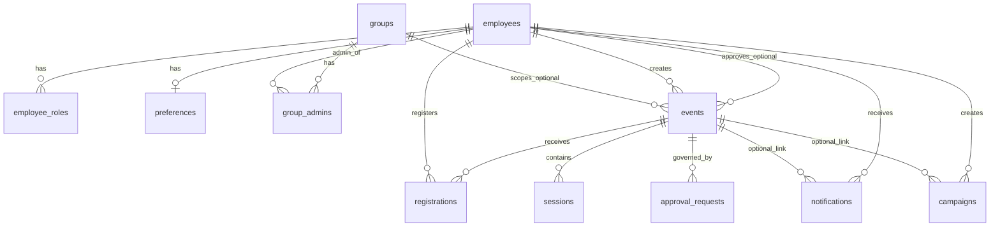

# Event Hub — implemented features (technical reference)

This document describes **what is built and wired today** in code. It complements `CONTEXT.md`, `MASTER_IMPLEMENTATION_PLAN.md`, and `planning/IMPLEMENTATION_LOG.md` (decisions + changelog). For **phase-by-phase gap analysis** against the master plan, see root **`TECHNICAL_REFERENCE.md`**.

**Last aligned with branch work:** `db-changes` (PostgreSQL, JWT dev auth, events, registrations, approvals, Infy-style UI).

---

## 1. Stack

| Layer | Technology |
|-------|------------|
| API | Python 3.10+, FastAPI, Pydantic v2, Uvicorn |
| ORM / DB | SQLAlchemy 2 async, Alembic, PostgreSQL 14+ (16 recommended) |
| Auth (dev) | JWT (`python-jose`), `POST /auth/login` with configurable roles |
| UI | React 18, TypeScript, Vite 5, Tailwind, TanStack Query, React Router |
| Optional shell | Electron workspace (see root `package.json`) |

API JSON uses **snake_case**. The frontend maps to UI types in `frontend/src/lib/eventMap.ts` and `frontend/src/types/api.ts`.

---

## 2. Backend — implemented capabilities

### 2.1 HTTP routes

| Method | Path | Purpose |
|--------|------|---------|
| GET | `/` | Browser: HTML index with links. API clients (`Accept` not `text/html` first): JSON metadata. |
| GET | `/health` | Liveness + DB probe; `integrations` (mock/live flags); `admin_metrics_stub` pointer for future telemetry. |
| GET | `/docs` | Swagger UI (**bundled** under `backend/static/swagger-ui/`, no CDN). |
| GET | `/openapi.json` | OpenAPI 3 schema. |
| POST | `/auth/login` | Dev login: upsert employee, issue JWT (`DevLoginRequest`). |
| POST | `/auth/login/sso` | **501** unless **`INTEGRATION_MOCK_SSO_LOGIN=true`**: demo cookie `mock_sso|email|roles|first|last` → JWT (see `integrations/corporate_stubs.py`). Real Infosys SSO replaces this block. |
| GET | `/auth/me` | Current user from Bearer token. |
| GET | `/events` | Paginated list; query `category`, `status` (UI filter), `page`, `page_size`. |
| GET | `/events/{event_id}` | Detail + sessions + `my_registration_status` when authenticated. |
| POST | `/events` | Create event + sessions (roles: `speaker`, `organizer`, `admin`, `platform_admin`). |
| PATCH | `/events/{event_id}` | Update (owner or privileged roles). |
| DELETE | `/events/{event_id}` | Delete **draft** only. |
| POST | `/events/{event_id}/submit` | Draft → Pending Approval + `approval_requests` row. |
| POST | `/events/{event_id}/register` | Register or waitlist; handles re-register from `cancelled`. |
| DELETE | `/events/{event_id}/register` | Cancel registration; promotes oldest waitlist when a seated seat frees. |
| GET | `/registrations/me` | Current user’s `registered` / `waitlisted` rows as event list items. |
| GET | `/approvals/pending` | Inbox for `organizer`, `admin`, `platform_admin`. |
| PATCH | `/approvals/{approval_id}` | `decision`: `approve` \| `reject` \| `request_modification`; optional `review_comment`. |
| POST | `/auth/refresh` | Body `{ refresh_token }` → new `access_token` (+ rotated `refresh_token`). |
| GET | `/events/my-sessions` | Speaker/creator events; query `status`, pagination. |
| GET | `/events/stats` | `upcoming`, `live`, `registered_by_me`, `total_active`. |
| GET | `/events/{id}/calendar.ics` | Single active event ICS (`text/calendar`). |
| GET | `/events/{id}/registrations` | Organizer+ attendee list; query `status`, `page`. |
| GET | `/registrations/me/calendar.ics` | ICS for user’s registered/waitlisted active events. |
| PATCH | `/registrations/{id}/attend` | Organizer+ marks seated registration `attended`. |
| GET | `/approvals` | Paginated approval queue; query `status`, `group_id`. |
| GET | `/approvals/my-requests` | Speaker+ submissions. |
| GET/POST/PATCH | `/groups`, `/groups/{id}`, `/groups/{id}/admins` | List (any auth user); mutations **admin** / **platform_admin**. |
| GET/POST/PATCH/DELETE | `/campaigns` … | Campaign CRUD + `POST …/send-now` (mock post); background scheduler ticks every 60s. |
| GET/PATCH | `/notifications`, `…/unread-count`, `…/read-all`, `…/{id}/read` | In-app notifications. |
| GET/PATCH | `/preferences` | Read/update user preferences (`notification_times` as `HH:MM` strings). |
| GET | `/master-data/units`, `/master-data/sub-units` | **Static dev** payloads; replace with Infosys proxy later. |
| GET | `/integrations/teams-channels`, `…/viva-groups` | **Mock** channel lists for campaigns UI. |
| GET | `/recommendations`, `/recommendations/trending` | Preference-weighted upcoming list; live events by attendance. |
| GET/POST/DELETE/PATCH | `/admin/users`, `…/roles`, `…/access-matrix`, `…/logs`, `…/config`, `…/stats` | Admin matrix; **`audit_logs`** table + `GET /admin/logs`; **`PATCH /admin/config`** persists JSON to `backend/data/admin_config.json` (gitignored). |

### 2.2 Domain logic (high level)

- **Events:** CRUD subset, list filters with explicit slug → `event_type` mapping (avoids ambiguous “Others” vs “Technology” slug collision).
- **Approvals:** Approve → event `Active`; reject → `Rejected`; request modification → event `Draft`, approval `Modification Requested`. Re-submit reuses the same approval row when status was modification requested.
- **Registrations:** Capacity vs `slots`; overflow → `waitlisted`; cancel from `registered` may promote waitlist.
- **Auth:** `Employee` + `EmployeeRole`; stable WID from dev email (`uuid5`); default `Preference` row on first dev login; access + refresh JWT (`typ` claim).
- **Notifications:** Approval outcomes, registration, waitlist promotion, and (on go-live) preference-matched **`new_event`** when frequency is **immediate**; **digest / weekly batches** not scheduled (see §6).
- **Campaigns:** Mock “post”; `Scheduled` campaigns picked up by app lifespan task.
- **Audit:** Append-only `audit_logs` on approval decisions, admin config patch, and platform role add/remove; **reminders:** background loop (~5 min) sends **`reminder_24h`** / **`reminder_1h`** in-app notifications to registered attendees (deduped per user/event/type).

### 2.3 Database models

Physical schema is defined by **SQLAlchemy models** under `backend/app/models/` and applied by Alembic revision `20250402_0001_initial_schema` (`metadata.create_all`). A **full table-by-table design** is in **[§ 7](#7-database-schema-design-postgresql)** below. Product-level ER notes: `reference_docs/db_design.md`.

---

## 3. Frontend — implemented capabilities

### 3.1 Routes (web)

| Path | Behavior |
|------|----------|
| `/` | Dashboard: live `GET /events`, category filter, grid/list. |
| `/event/:id` | Event detail, sessions, register / cancel / leave waitlist (API). |
| `/calendar` | Month navigation; registrations from `GET /registrations/me`. |
| `/create-event` | Multi-session create + optional submit. |
| `/approvals` | Pending approvals queue (`GET` / `PATCH`); organizer + admin nav. |
| `/preferences`, `/notifications`, `/campaigns`, `/admin/*` | **Wired** to API (TanStack Query + forms). |
| `/manage-events` | **`GET /events/my-sessions`** — tabs for draft/pending, active, completed; link to **`/approvals`**. |

### 3.2 Auth & layout

- **`AuthContext`:** JWT in `localStorage`, `GET /auth/me`, dev sign-in button, role switcher (UI-only; server enforces roles).
- **`BackendStatusPill`:** API/DB status from `GET /health` (visible from `sm` breakpoint + dot on xs).
- **Sidebar:** Persona menus (audience, speaker, organizer, admin); `platform_admin` maps to admin persona in UI.

### 3.3 Data hooks

- `useEvents`, `useEventDetail`, `useMySessions`, `useRegistrations`, `useApprovals`, `useBackendHealth`, `useNotifications`, `usePreferences`, `useGroupsList`, `useCampaigns`, `useAdmin` (+ `useAdminLogs`).

---

## 4. Tooling & operations

| Script / doc | Role |
|--------------|------|
| `scripts/setup-db.sh` | Local Postgres: run `init_local_db.sql` + `alembic upgrade` (set `PGUSER` on Mac Homebrew). |
| `scripts/init_local_db.sql` | Create `eventhub` role/DB. |
| `scripts/docker-up.sh` | Start Docker Compose Postgres only (when Docker allowed). |
| `scripts/run-backend.sh` | Docker (if any) + venv + migrate + uvicorn. |
| `scripts/run-all.sh` | Same + attempt frontend `npm run dev`. |
| `scripts/fetch-swagger-ui.sh` | Refresh vendored Swagger assets. |
| `planning/LOCAL_POSTGRES_SETUP.md` | No-Docker Postgres on Mac/Windows/Linux. |
| `planning/DOCKER_SETUP.md` | Docker volume persistence and portability. |

### 4.1 Configuration

- **`backend/.env`:** `DATABASE_URL` (asyncpg), `SYNC_DATABASE_URL` (psycopg2 for Alembic), `JWT_SECRET`, `ALLOW_DEV_LOGIN`.
- **`frontend/.env`:** `VITE_API_BASE` (default `http://127.0.0.1:8000`).
- **CORS:** `127.0.0.1:8080`, `localhost:8080`, `::1`, `null` (Electron file).

---

## 5. Seed data

- **`python -m scripts.seed_demo_events`** (from `backend/` with venv): demo employee `demo.seed@example.com` and two **Active** events if the events table is empty (or per script logic).

---

## 6. Out of scope and deferred work

This section lists what is **intentionally not built yet** or only **stubbed**, so scope conversations stay explicit. For changelog detail see `planning/IMPLEMENTATION_LOG.md`; for product/doc alignment see `planning/SYNTHESIS_AND_GAPS.md` and `reference_docs/PS.md`.

### 6.1 Enterprise auth and integrations

| Item | Status |
|------|--------|
| Infosys **SSO** / session cookie exchange | `POST /auth/login/sso` returns **501** |
| **`infosys_api.py`** (or equivalent) HTTP clients | Not present — no live calls to `reference_docs/apis.json` URLs |
| **Master-data** (`/master-data/*`) | **Static dev JSON** only, not Lex / API gateway |
| **Zscaler** / corporate TLS (`ZSCALER_CA_PATH`, custom CA for `httpx`) | Not implemented (`MASTER_IMPLEMENTATION_PLAN.md` §7) |
| **Microsoft Graph** / real Outlook beyond `.ics` download | Not implemented |
| **Teams / Viva / InfyMe** campaign posting | **Mock** only (`/integrations/*`, campaign send-now logs) |

### 6.2 Product gaps vs `PS.md` / CONTEXT

| Item | Status |
|------|--------|
| Separate **governance** persona | **`governance`** in `employee_roles`; UI persona **Governance team** (sidebar: Dashboard, Campaigns, Notifications, Calendar); API: campaigns + integrations; **not** approval queue (PS.md — organizers approve) |
| **Background hub** behavior (idle, auto-popup, “away 1h”) | Not implemented in web/Electron |
| **Daily / weekly notification digests** | `notification_frequency` values exist; **no scheduler** batches digests |
| **Event reminders** (e.g. 1h before) | **In-app** reminders for registered users (~24h / ~1h windows); no email/push |
| **Intelligent / SLM** recommendations | `/recommendations` is **heuristic** only |
| **News hub** (PS good-to-have) | Not started |
| **App Admin** performance monitoring / real error telemetry | Not implemented |

### 6.3 UI and workflows still thin

| Item | Status |
|------|--------|
| **`/manage-events`** | **Wired** to **`/events/my-sessions`** (see §3.1) |
| **Followed groups** in Preferences UI | **`GET /groups`** checkboxes + **`followed_group_ids`** on save |
| **Rich campaign builder** (multi-channel, real channel IDs from Graph) | Basic create + list only |

### 6.4 Data, admin, and migrations

| Item | Status |
|------|--------|
| **`GET /admin/logs`** | **`audit_logs`** table; approval + admin actions appended |
| **`PATCH /admin/config`** | **File-backed** JSON under `backend/data/` (see §2.1) |
| **Alembic** | Initial revision uses **`metadata.create_all`** style bootstrap; **no** rich `op.*` migration history for every change |

### 6.5 Electron (Phase 7 remainder)

| Item | Status |
|------|--------|
| Tray + hide-on-close | **Implemented** (minimal icon) |
| **Native** OS notifications (polling `/notifications`) | Not implemented |
| Backend **health monitor** + auto-restart child process | Not implemented |
| **Auto-start on login**, **idle** detection | Not implemented |
| **electron-updater** / packaging hardening | Not implemented |

### 6.6 Testing and quality gates

| Item | Status |
|------|--------|
| RBAC **integration** tests (per-role matrix) | Not in repo |
| **`pytest`** smoke (`GET /health`) | `backend/tests/test_health.py` |
| **Playwright** (or similar) E2E against API + UI | Not in repo |
| Load / performance tests (`MASTER` §6 tables) | Not in repo |

---

## 7. Database schema design (PostgreSQL)

### 7.1 Principles

- **PK types:** `employees.wid` and all employee FKs use **UUID**. `events.id` is **UUID** with default `gen_random_uuid()` (requires PostgreSQL crypto/pgcrypto availability as per server defaults).
- **Strings for enums:** Status and role-like fields are **varchar** in DB (e.g. `events.status`, `registrations.status`, `approval_requests.status`); application code enforces allowed values.
- **Timestamps:** Important columns use `TIMESTAMPTZ` (`DateTime(timezone=True)`).
- **Arrays:** PostgreSQL `ARRAY` for tags, preferences, campaign channel lists, etc.

### 7.2 Entity relationships (overview)

### 7.3 Tables (columns & constraints)

**`employees`** — person; PK `wid` UUID. Columns: `source_id` (unique, nullable), `first_name`, `last_name`, `email` (unique), org fields (`job_title`, `job_role`, `department_name`, `unit_name`, `sub_department_name`, `region`, `current_location`, `base_location`), `is_manager`, `manager_wid` → `employees.wid` ON DELETE SET NULL, `is_active`, `created_at`, `updated_at`.  
**API:** auth / event ownership / registrations / approvals.

**`employee_roles`** — PK `id` serial. `employee_wid` → `employees.wid` ON DELETE CASCADE, `role` varchar(50). **Unique** `(employee_wid, role)`.  
**API:** JWT claims / `require_roles`.

**`preferences`** — PK `id` serial. `employee_wid` → `employees.wid` ON DELETE CASCADE **unique**. Arrays: `event_types`, `interests`, `notification_mechanisms`, `notification_times`, `followed_group_ids`; `notification_frequency`, `notify_on_login`, `updated_at`.  
**API:** `GET/PATCH /preferences`; row created on dev login; **Preferences** page wired.

**`groups`** — PK `id` serial. `name`, `description`, `org` (default Infosys), `geo`, `unit`, `subunit`, `location`, `dl_emails` array, `is_active`, `created_by` → `employees.wid`, `created_at`.  
**API:** `GET/POST/PATCH /groups` (+ admins); optional `events.group_id`.

**`group_admins`** — composite PK `(group_id, employee_wid)` → `groups.id` / `employees.wid` ON DELETE CASCADE, `assigned_at`.  
**API:** `POST/DELETE /groups/{id}/admins`; **organizer-only approval scope** uses this (organizers see/approve only events for groups they administer unless `event.group_id` is null).

**`events`** — PK `id` UUID default `gen_random_uuid()`. `title`, `description`, `thumbnail_url`, `banner_url`, `event_type`, `tags` array, `delivery_method`, `instruction_medium`, `start_date`, `end_date`, `timezone`, `venue_code`, `venue_name`, `event_url`, `slots` (capacity), `status`, `visibility`, `group_id` → `groups.id` nullable, `created_by` / `approved_by` → `employees.wid`, `approved_at`, `created_at`, `updated_at`.  
**API:** full event lifecycle + list filters.

**`sessions`** (table name `sessions`) — PK `id` serial. `event_id` → `events.id` ON DELETE CASCADE, `session_order`, `topic`, `topic_brief`, `start_datetime`, `duration_minutes`, `speaker_wid` → `employees.wid`, denormalized `speaker_*` fields, `speaker_linkedin`, `speaker_headshot_url`, `session_url`, `created_at`.  
**API:** embedded in event detail / create.

**`registrations`** — PK `id` serial. `employee_wid` → `employees.wid` ON DELETE CASCADE, `event_id` → `events.id` ON DELETE CASCADE, `status` (e.g. registered / waitlisted / cancelled), `added_to_calendar`, `registered_at`. **Unique** `(employee_wid, event_id)`.  
**API:** register / cancel / my registrations.

**`approval_requests`** — PK `id` serial. `event_id` → `events.id` ON DELETE CASCADE, `requested_by` / `reviewed_by` → `employees.wid`, `status`, `request_note`, `review_comment`, `requested_at`, `reviewed_at`.  
**API:** submit + pending list + PATCH review.

**`notifications`** — PK `id` serial. `employee_wid` → `employees.wid` ON DELETE CASCADE, optional `event_id` → `events.id`, `type`, `title`, `body`, `is_read`, `created_at`.  
**API:** full notification routes; triggers on registration, approval outcomes, waitlist promotion, new active event (preference match, immediate only). **Notifications** page + header badge wired.

**`campaigns`** — PK `id` serial. `event_id` → `events.id` ON DELETE CASCADE, `created_by` → `employees.wid`, `message`, `teams_channel_ids` / `viva_group_ids` arrays, `infyme_banner`, `scheduled_at`, `status`, `posted_at`, `failure_reason`, `created_at`.  
**API:** `/campaigns` CRUD + send-now (mock); scheduler in app lifespan. **Campaigns** page wired.

**`audit_logs`** — PK `id` serial. `action` varchar, `detail` text, `actor_wid` → `employees.wid` nullable, `created_at`.  
**API:** `GET /admin/logs`; rows from approvals and platform-admin actions.

### 7.4 Migration

- **Revision:** `backend/alembic/versions/20250402_0001_initial_schema.py` — `upgrade()` calls `Base.metadata.create_all(bind)` for all models imported on `Base.metadata`.

---

## 8. Key file map

| Area | Paths |
|------|--------|
| API entry | `backend/main.py` → `app.main:app` |
| Routers | `backend/app/routers/*.py` |
| Services | `backend/app/services/*.py` |
| Models | `backend/app/models/*.py` |
| Migrations | `backend/alembic/versions/` |
| UI entry | `frontend/src/App.tsx`, `frontend/src/components/AppLayout.tsx` |
| API client | `frontend/src/lib/api.ts` |
