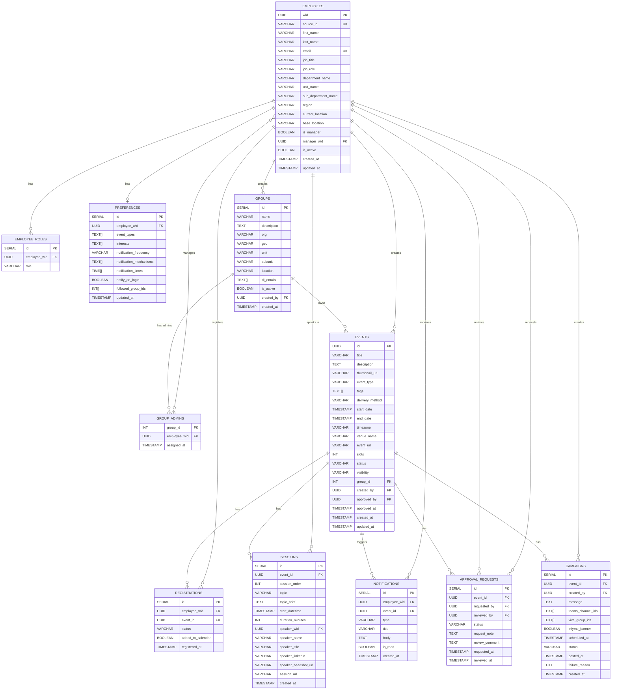
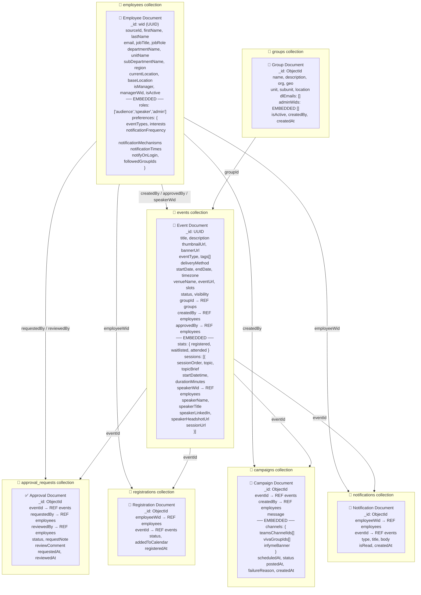

# Event Hub — Complete Database Design

---

## Overview

| Collection / Table | Purpose |
|---|---|
| employees | Core user entity — all personas (audience, speaker, organizer, admin) |
| employee_roles | Role assignments per employee (SQL only) |
| preferences | Notification & interest preferences (embedded in MongoDB) |
| groups | Chapters/Communities that govern events |
| group_admins | M:M bridge — which employees admin which groups |
| events | Core event entity with sessions embedded (MongoDB) or separate (SQL) |
| sessions | Individual sessions within an event |
| approval_requests | Governance audit trail |
| registrations | Employee ↔ Event junction |
| campaigns | Campaign scheduling for Teams / Viva Engage |
| notifications | Per-user notification log |

---

## Entity Relationships

```
employees ──── preferences          (1:1)
employees ──── employee_roles       (1:M)
employees ──── group_admins         (M:M via bridge)
employees ──── registrations        (1:M)
employees ──── notifications        (1:M)
employees ──── events               (1:M — as creator)
employees ──── sessions             (1:M — as speaker)
employees ──── approval_requests    (1:M — as requester & reviewer)
employees ──── campaigns            (1:M — as creator)
groups    ──── group_admins         (1:M)
groups    ──── events               (1:M)
events    ──── sessions             (1:M)
events    ──── approval_requests    (1:1)
events    ──── registrations        (1:M)
events    ──── campaigns            (1:M)
events    ──── notifications        (1:M)
```

---

## Status State Machines

### Event Status
```
Draft ──→ Pending Approval ──→ Active
                          └──→ Rejected
Active ──→ Cancelled
```

### Approval Request Status
```
Pending ──→ Approved
        └──→ Rejected
        └──→ Modification Requested ──→ Pending (re-submitted)
```

### Registration Status
```
registered ──→ attended
           └──→ cancelled
waitlisted ──→ registered (when slot opens)
           └──→ cancelled
```

### Campaign Status
```
Draft ──→ Scheduled ──→ Posted
                    └──→ Failed
```

---

## ER Diagram (SQL — Mermaid)



---

## Collection Map (MongoDB — Mermaid)



---

## SQL — Full DDL (PostgreSQL)

```sql
-- ============================================================
-- 1. EMPLOYEES
-- ============================================================
CREATE TABLE employees (
    wid                 UUID PRIMARY KEY,
    source_id           VARCHAR(20) UNIQUE,
    first_name          VARCHAR(100) NOT NULL,
    last_name           VARCHAR(100) NOT NULL,
    email               VARCHAR(200) UNIQUE NOT NULL,
    job_title           VARCHAR(200),
    job_role            VARCHAR(100),
    department_name     VARCHAR(200),
    unit_name           VARCHAR(200),
    sub_department_name VARCHAR(200),
    region              VARCHAR(100),
    current_location    VARCHAR(100),
    base_location       VARCHAR(100),
    is_manager          BOOLEAN DEFAULT FALSE,
    manager_wid         UUID REFERENCES employees(wid),
    is_active           BOOLEAN DEFAULT TRUE,
    created_at          TIMESTAMP DEFAULT NOW(),
    updated_at          TIMESTAMP DEFAULT NOW()
);

-- ============================================================
-- 2. EMPLOYEE ROLES
-- ============================================================
CREATE TABLE employee_roles (
    id              SERIAL PRIMARY KEY,
    employee_wid    UUID NOT NULL REFERENCES employees(wid) ON DELETE CASCADE,
    role            VARCHAR(50) NOT NULL
                    CHECK (role IN ('audience','speaker','organizer','admin','platform_admin')),
    UNIQUE(employee_wid, role)
);

-- ============================================================
-- 3. PREFERENCES
-- ============================================================
CREATE TABLE preferences (
    id                      SERIAL PRIMARY KEY,
    employee_wid            UUID UNIQUE NOT NULL REFERENCES employees(wid) ON DELETE CASCADE,
    event_types             TEXT[],
    interests               TEXT[],
    notification_frequency  VARCHAR(50) DEFAULT 'immediate'
                            CHECK (notification_frequency IN ('immediate','daily_digest','weekly')),
    notification_mechanisms TEXT[],
    notification_times      TIME[],
    notify_on_login         BOOLEAN DEFAULT TRUE,
    followed_group_ids      INTEGER[],
    updated_at              TIMESTAMP DEFAULT NOW()
);

-- ============================================================
-- 4. GROUPS
-- ============================================================
CREATE TABLE groups (
    id              SERIAL PRIMARY KEY,
    name            VARCHAR(200) NOT NULL,
    description     TEXT,
    org             VARCHAR(100) DEFAULT 'Infosys',
    geo             VARCHAR(100),
    unit            VARCHAR(200),
    subunit         VARCHAR(200),
    location        VARCHAR(100),
    dl_emails       TEXT[],
    is_active       BOOLEAN DEFAULT TRUE,
    created_by      UUID REFERENCES employees(wid),
    created_at      TIMESTAMP DEFAULT NOW()
);

-- Group admins bridge table
CREATE TABLE group_admins (
    group_id        INTEGER NOT NULL REFERENCES groups(id) ON DELETE CASCADE,
    employee_wid    UUID NOT NULL REFERENCES employees(wid) ON DELETE CASCADE,
    assigned_at     TIMESTAMP DEFAULT NOW(),
    PRIMARY KEY (group_id, employee_wid)
);

-- ============================================================
-- 5. EVENTS
-- ============================================================
CREATE TABLE events (
    id                  UUID PRIMARY KEY DEFAULT gen_random_uuid(),
    title               VARCHAR(300) NOT NULL,
    description         TEXT,
    thumbnail_url       VARCHAR(500),
    banner_url          VARCHAR(500),
    event_type          VARCHAR(50) NOT NULL
                        CHECK (event_type IN ('Technology','Health','Fun','Domain','Product','Others')),
    tags                TEXT[],
    delivery_method     VARCHAR(20) DEFAULT 'Virtual'
                        CHECK (delivery_method IN ('Virtual','Physical','Hybrid')),
    instruction_medium  VARCHAR(10) DEFAULT 'en',
    start_date          TIMESTAMP NOT NULL,
    end_date            TIMESTAMP NOT NULL,
    timezone            VARCHAR(100) DEFAULT 'Asia/Calcutta',
    venue_code          VARCHAR(100),
    venue_name          VARCHAR(200),
    event_url           VARCHAR(500),
    slots               INTEGER,
    status              VARCHAR(30) DEFAULT 'Draft'
                        CHECK (status IN ('Draft','Pending Approval','Active','Rejected','Cancelled')),
    visibility          VARCHAR(20) DEFAULT 'org-wide'
                        CHECK (visibility IN ('org-wide','unit','group')),
    group_id            INTEGER REFERENCES groups(id),
    created_by          UUID NOT NULL REFERENCES employees(wid),
    approved_by         UUID REFERENCES employees(wid),
    approved_at         TIMESTAMP,
    created_at          TIMESTAMP DEFAULT NOW(),
    updated_at          TIMESTAMP DEFAULT NOW()
);

-- ============================================================
-- 6. SESSIONS
-- ============================================================
CREATE TABLE sessions (
    id                      SERIAL PRIMARY KEY,
    event_id                UUID NOT NULL REFERENCES events(id) ON DELETE CASCADE,
    session_order           INTEGER NOT NULL DEFAULT 1,
    topic                   VARCHAR(300) NOT NULL,
    topic_brief             TEXT,
    start_datetime          TIMESTAMP NOT NULL,
    duration_minutes        INTEGER NOT NULL,
    speaker_wid             UUID REFERENCES employees(wid),
    speaker_name            VARCHAR(200),
    speaker_title           VARCHAR(200),
    speaker_linkedin        VARCHAR(500),
    speaker_headshot_url    VARCHAR(500),
    session_url             VARCHAR(500),
    created_at              TIMESTAMP DEFAULT NOW()
);

-- ============================================================
-- 7. APPROVAL REQUESTS
-- ============================================================
CREATE TABLE approval_requests (
    id              SERIAL PRIMARY KEY,
    event_id        UUID NOT NULL REFERENCES events(id) ON DELETE CASCADE,
    requested_by    UUID NOT NULL REFERENCES employees(wid),
    reviewed_by     UUID REFERENCES employees(wid),
    status          VARCHAR(30) DEFAULT 'Pending'
                    CHECK (status IN ('Pending','Approved','Rejected','Modification Requested')),
    request_note    TEXT,
    review_comment  TEXT,
    requested_at    TIMESTAMP DEFAULT NOW(),
    reviewed_at     TIMESTAMP
);

-- ============================================================
-- 8. REGISTRATIONS
-- ============================================================
CREATE TABLE registrations (
    id                  SERIAL PRIMARY KEY,
    employee_wid        UUID NOT NULL REFERENCES employees(wid) ON DELETE CASCADE,
    event_id            UUID NOT NULL REFERENCES events(id) ON DELETE CASCADE,
    status              VARCHAR(20) DEFAULT 'registered'
                        CHECK (status IN ('registered','waitlisted','cancelled','attended')),
    added_to_calendar   BOOLEAN DEFAULT FALSE,
    registered_at       TIMESTAMP DEFAULT NOW(),
    UNIQUE(employee_wid, event_id)
);

-- ============================================================
-- 9. CAMPAIGNS
-- ============================================================
CREATE TABLE campaigns (
    id                  SERIAL PRIMARY KEY,
    event_id            UUID NOT NULL REFERENCES events(id) ON DELETE CASCADE,
    created_by          UUID NOT NULL REFERENCES employees(wid),
    message             TEXT NOT NULL,
    teams_channel_ids   TEXT[],
    viva_group_ids      TEXT[],
    infyme_banner       BOOLEAN DEFAULT FALSE,
    scheduled_at        TIMESTAMP NOT NULL,
    status              VARCHAR(20) DEFAULT 'Draft'
                        CHECK (status IN ('Draft','Scheduled','Posted','Failed')),
    posted_at           TIMESTAMP,
    failure_reason      TEXT,
    created_at          TIMESTAMP DEFAULT NOW()
);

-- ============================================================
-- 10. NOTIFICATIONS
-- ============================================================
CREATE TABLE notifications (
    id              SERIAL PRIMARY KEY,
    employee_wid    UUID NOT NULL REFERENCES employees(wid) ON DELETE CASCADE,
    event_id        UUID REFERENCES events(id),
    type            VARCHAR(50),
    title           VARCHAR(300),
    body            TEXT,
    is_read         BOOLEAN DEFAULT FALSE,
    created_at      TIMESTAMP DEFAULT NOW()
);

-- ============================================================
-- INDEXES
-- ============================================================
CREATE INDEX idx_events_status        ON events(status);
CREATE INDEX idx_events_start_date    ON events(start_date);
CREATE INDEX idx_events_type          ON events(event_type);
CREATE INDEX idx_events_group         ON events(group_id);
CREATE INDEX idx_events_created_by    ON events(created_by);
CREATE INDEX idx_registrations_emp    ON registrations(employee_wid);
CREATE INDEX idx_registrations_event  ON registrations(event_id);
CREATE INDEX idx_sessions_event       ON sessions(event_id);
CREATE INDEX idx_notifications_emp    ON notifications(employee_wid, is_read);
CREATE INDEX idx_approval_event       ON approval_requests(event_id);
CREATE INDEX idx_campaigns_event      ON campaigns(event_id);
CREATE INDEX idx_campaigns_scheduled  ON campaigns(scheduled_at, status);
```

---

## NoSQL — Mongoose Schemas (MongoDB)

```js
// ============================================================
// models/Employee.js
// ============================================================
const mongoose = require('mongoose');

const PreferencesSchema = new mongoose.Schema({
  eventTypes:             [String],       // ['Technology','Health','Fun','Domain','Product']
  interests:              [String],       // ['AI','Cloud','Wellness']
  notificationFrequency:  {
    type: String,
    enum: ['immediate', 'daily_digest', 'weekly'],
    default: 'immediate'
  },
  notificationMechanisms: [String],       // ['in_app','email','teams']
  notificationTimes:      [String],       // ['09:00','17:00']
  notifyOnLogin:          { type: Boolean, default: true },
  followedGroupIds:       [mongoose.Schema.Types.ObjectId]
}, { _id: false });

const EmployeeSchema = new mongoose.Schema({
  _id:                String,             // wid from Infosys user API
  sourceId:           String,             // employee number
  firstName:          { type: String, required: true },
  lastName:           { type: String, required: true },
  email:              { type: String, required: true, unique: true },
  jobTitle:           String,
  jobRole:            String,
  departmentName:     String,
  unitName:           String,             // from master-data/unit API
  subDepartmentName:  String,             // from master-data/sub_unit API
  region:             String,
  currentLocation:    String,
  baseLocation:       String,
  isManager:          { type: Boolean, default: false },
  managerWid:         String,
  isActive:           { type: Boolean, default: true },
  roles: [{
    type: String,
    enum: ['audience', 'speaker', 'organizer', 'admin', 'platform_admin']
  }],
  preferences:        PreferencesSchema
}, { timestamps: true });

EmployeeSchema.index({ email: 1 });
EmployeeSchema.index({ unitName: 1 });
EmployeeSchema.index({ 'preferences.eventTypes': 1 });

module.exports = mongoose.model('Employee', EmployeeSchema);


// ============================================================
// models/Group.js
// ============================================================
const GroupSchema = new mongoose.Schema({
  name:         { type: String, required: true },
  description:  String,
  org:          { type: String, default: 'Infosys' },
  geo:          String,                   // 'APAC' | 'Americas' | 'Europe'
  unit:         String,
  subunit:      String,
  location:     String,
  dlEmails:     [String],
  adminWids:    [String],                 // wids of admin employees
  isActive:     { type: Boolean, default: true },
  createdBy:    { type: String, ref: 'Employee' }
}, { timestamps: true });

module.exports = mongoose.model('Group', GroupSchema);


// ============================================================
// models/Event.js
// ============================================================
const SessionSchema = new mongoose.Schema({
  sessionOrder:       { type: Number, default: 1 },
  topic:              { type: String, required: true },
  topicBrief:         String,
  startDatetime:      { type: Date, required: true },
  durationMinutes:    { type: Number, required: true },
  speakerWid:         { type: String, ref: 'Employee' },  // null if external
  speakerName:        String,
  speakerTitle:       String,
  speakerLinkedIn:    String,
  speakerHeadshotUrl: String,
  sessionUrl:         String
}, { _id: true });

const EventSchema = new mongoose.Schema({
  _id:              { type: String, default: () => require('uuid').v4() },
  title:            { type: String, required: true },
  description:      String,
  thumbnailUrl:     String,
  bannerUrl:        String,
  eventType:        {
    type: String,
    required: true,
    enum: ['Technology', 'Health', 'Fun', 'Domain', 'Product', 'Others']
  },
  tags:             [String],
  deliveryMethod:   {
    type: String,
    enum: ['Virtual', 'Physical', 'Hybrid'],
    default: 'Virtual'
  },
  instructionMedium: { type: String, default: 'en' },
  startDate:        { type: Date, required: true },
  endDate:          { type: Date, required: true },
  timezone:         { type: String, default: 'Asia/Calcutta' },
  venueCode:        String,
  venueName:        String,
  eventUrl:         String,
  slots:            Number,               // null = unlimited
  stats: {
    registered:     { type: Number, default: 0 },
    waitlisted:     { type: Number, default: 0 },
    attended:       { type: Number, default: 0 }
  },
  status: {
    type: String,
    enum: ['Draft', 'Pending Approval', 'Active', 'Rejected', 'Cancelled'],
    default: 'Draft'
  },
  visibility: {
    type: String,
    enum: ['org-wide', 'unit', 'group'],
    default: 'org-wide'
  },
  groupId:          { type: mongoose.Schema.Types.ObjectId, ref: 'Group' },
  createdBy:        { type: String, ref: 'Employee', required: true },
  approvedBy:       { type: String, ref: 'Employee' },
  approvedAt:       Date,
  sessions:         [SessionSchema]
}, { timestamps: true });

EventSchema.index({ status: 1, startDate: 1 });
EventSchema.index({ eventType: 1 });
EventSchema.index({ tags: 1 });
EventSchema.index({ groupId: 1 });
EventSchema.index({ createdBy: 1 });
EventSchema.index({ title: 'text', description: 'text', tags: 'text' });

module.exports = mongoose.model('Event', EventSchema);


// ============================================================
// models/ApprovalRequest.js
// ============================================================
const ApprovalRequestSchema = new mongoose.Schema({
  eventId:        { type: String, ref: 'Event', required: true },
  requestedBy:    { type: String, ref: 'Employee', required: true },
  reviewedBy:     { type: String, ref: 'Employee' },
  status: {
    type: String,
    enum: ['Pending', 'Approved', 'Rejected', 'Modification Requested'],
    default: 'Pending'
  },
  requestNote:    String,
  reviewComment:  String,
  requestedAt:    { type: Date, default: Date.now },
  reviewedAt:     Date
}, { timestamps: false });

ApprovalRequestSchema.index({ eventId: 1 });
ApprovalRequestSchema.index({ requestedBy: 1 });
ApprovalRequestSchema.index({ status: 1 });

module.exports = mongoose.model('ApprovalRequest', ApprovalRequestSchema);


// ============================================================
// models/Registration.js
// ============================================================
const RegistrationSchema = new mongoose.Schema({
  employeeWid:      { type: String, ref: 'Employee', required: true },
  eventId:          { type: String, ref: 'Event', required: true },
  status: {
    type: String,
    enum: ['registered', 'waitlisted', 'cancelled', 'attended'],
    default: 'registered'
  },
  addedToCalendar:  { type: Boolean, default: false },
  registeredAt:     { type: Date, default: Date.now }
});

RegistrationSchema.index({ employeeWid: 1 });
RegistrationSchema.index({ eventId: 1 });
RegistrationSchema.index({ employeeWid: 1, eventId: 1 }, { unique: true });

module.exports = mongoose.model('Registration', RegistrationSchema);


// ============================================================
// models/Campaign.js
// ============================================================
const CampaignSchema = new mongoose.Schema({
  eventId:      { type: String, ref: 'Event', required: true },
  createdBy:    { type: String, ref: 'Employee', required: true },
  message:      { type: String, required: true },
  channels: {
    teamsChannelIds:  [String],
    vivaGroupIds:     [String],
    infymeBanner:     { type: Boolean, default: false }
  },
  scheduledAt:  { type: Date, required: true },
  status: {
    type: String,
    enum: ['Draft', 'Scheduled', 'Posted', 'Failed'],
    default: 'Draft'
  },
  postedAt:       Date,
  failureReason:  String
}, { timestamps: true });

CampaignSchema.index({ scheduledAt: 1, status: 1 });
CampaignSchema.index({ eventId: 1 });

module.exports = mongoose.model('Campaign', CampaignSchema);


// ============================================================
// models/Notification.js
// ============================================================
const NotificationSchema = new mongoose.Schema({
  employeeWid:  { type: String, ref: 'Employee', required: true },
  eventId:      { type: String, ref: 'Event' },
  type: {
    type: String,
    enum: ['new_event', 'reminder', 'approved', 'rejected', 'campaign', 'registration']
  },
  title:        String,
  body:         String,
  isRead:       { type: Boolean, default: false },
  createdAt:    { type: Date, default: Date.now }
}, { timestamps: false });

NotificationSchema.index({ employeeWid: 1, isRead: 1, createdAt: -1 });

module.exports = mongoose.model('Notification', NotificationSchema);
```

---

## NoSQL — Sample Documents

```json
// Employee with preferences + roles
{
  "_id": "4d6d6005-b702-43fb-8b7a-5cd4d8156e55",
  "sourceId": "1106124",
  "firstName": "Jayanti",
  "lastName": "Vishnoi",
  "email": "jayanti.vishnoi@ad.infosys.com",
  "jobTitle": "Specialist Programmer",
  "unitName": "Strategic Technology Group",
  "subDepartmentName": "Strategic Technology Group",
  "region": "India",
  "currentLocation": "Noida",
  "baseLocation": "Noida",
  "isManager": false,
  "isActive": true,
  "roles": ["audience", "speaker"],
  "preferences": {
    "eventTypes": ["Technology", "Health"],
    "interests": ["AI", "Cloud"],
    "notificationFrequency": "immediate",
    "notificationMechanisms": ["in_app", "teams"],
    "notificationTimes": ["09:00", "17:00"],
    "notifyOnLogin": true,
    "followedGroupIds": []
  }
}

// Event with embedded sessions
{
  "_id": "a1b2c3d4-e5f6-7890-abcd-ef1234567890",
  "title": "AI200: AI Insights in Actions",
  "description": "Comprehensive introduction to AI in business operations...",
  "thumbnailUrl": "https://images.onwingspan.com/...",
  "eventType": "Technology",
  "tags": ["AI", "GenAI", "Machine Learning"],
  "deliveryMethod": "Virtual",
  "startDate": "2026-04-10T09:30:00.000Z",
  "endDate": "2026-04-10T13:30:00.000Z",
  "timezone": "Asia/Calcutta",
  "eventUrl": "https://infosys.webex.com/meet/...",
  "slots": 150,
  "stats": { "registered": 82, "waitlisted": 5, "attended": 0 },
  "status": "Active",
  "visibility": "org-wide",
  "createdBy": "4d6d6005-b702-43fb-8b7a-5cd4d8156e55",
  "sessions": [
    {
      "sessionOrder": 1,
      "topic": "Introduction to GenAI",
      "topicBrief": "Overview of generative AI fundamentals",
      "startDatetime": "2026-04-10T09:30:00.000Z",
      "durationMinutes": 60,
      "speakerWid": "4d6d6005-b702-43fb-8b7a-5cd4d8156e55",
      "speakerName": "Jayanti Vishnoi",
      "speakerTitle": "Specialist Programmer",
      "speakerLinkedIn": "https://linkedin.com/in/jayanti-vishnoi",
      "speakerHeadshotUrl": "https://...",
      "sessionUrl": null
    }
  ],
  "createdAt": "2026-04-01T08:00:00.000Z",
  "updatedAt": "2026-04-01T08:00:00.000Z"
}

// Campaign
{
  "_id": "ObjectId(...)",
  "eventId": "a1b2c3d4-e5f6-7890-abcd-ef1234567890",
  "createdBy": "admin-wid-here",
  "message": "Don't miss our AI200 session this Thursday! Register now 👉 [link]",
  "channels": {
    "teamsChannelIds": ["channel-id-1", "channel-id-2"],
    "vivaGroupIds": ["viva-group-id-1"],
    "infymeBanner": true
  },
  "scheduledAt": "2026-04-08T09:00:00.000Z",
  "status": "Scheduled",
  "postedAt": null,
  "failureReason": null,
  "createdAt": "2026-04-01T08:00:00.000Z"
}
```

---

## Embed vs Reference Decision (MongoDB)

| Data | Decision | Reason |
|---|---|---|
| `preferences` inside Employee | EMBED | Always read together, unique to employee |
| `roles` inside Employee | EMBED | Small array, read on every auth check |
| `sessions` inside Event | EMBED | Sessions have no life outside their event |
| `stats` inside Event | EMBED | Updated frequently but always read with event |
| `adminWids` inside Group | EMBED | Small array, rarely changes |
| `channels` inside Campaign | EMBED | Always read with campaign doc |
| `groupId` in Event | REFERENCE | Group exists independently |
| `createdBy` in Event | REFERENCE | Employee exists independently |
| `eventId` in Registration | REFERENCE | Registration and Event are separate concerns |
| `eventId` in Campaign | REFERENCE | Campaign targets an independently-managed event |
| `eventId` in Notification | REFERENCE | Notification may outlive the event |

---

## Master Data APIs (External — Infosys)

These endpoints should be called live to populate dropdowns:

```
GET https://lex.infosysapps.com/api-gw/wn-apis/Infosys/master-data/master-data/get/unit
→ Returns all units. Use `value` field for display and storage.

GET https://lex.infosysapps.com/api-gw/wn-apis/Infosys/master-data/master-data/get/sub_unit
→ Returns subunits with parent unit in `related_values.unit`.
→ Use to cascade subunit dropdown when unit is selected.
```

Cache these responses locally (TTL: 1 hour) to avoid repeated calls.

---

## SQL vs MongoDB — Final Comparison

| Factor | SQL (PostgreSQL) | NoSQL (MongoDB) |
|---|---|---|
| Sessions inside event | Separate table, JOIN required | Embedded — 1 query |
| User + preferences | 2 tables, 1 JOIN | 1 document |
| Stats (registered count) | Aggregate query on registrations | Embedded `stats` field |
| Role enforcement | FK constraints, CHECK constraints | Application-level only |
| Schema changes during build | Requires migration | Add fields freely |
| Full-text event search | `tsvector` + GIN index | `$text` index / Atlas Search |
| Governance / audit trail | Strong — FK integrity, cascade | Manual referential integrity |
| Hackathon setup speed | Docker / Supabase | MongoDB Atlas free tier |
| **Recommendation** | Use for presentation / production pitch | **Use for actual hackathon build** |
